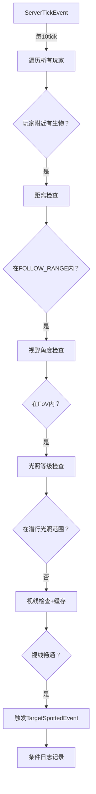

# Aperi Oculos - 技术文档

> **版本**: 1.0
> **目标平台**: Minecraft 1.21 (NeoForge)
> **最后更新**: 2025-10-10

---

## 📋 目录

1. [项目概述](#1-项目概述)
2. [架构设计](#2-架构设计)
3. [核心系统](#3-核心系统)
4. [公共API](#4-公共api)
5. [配置系统](#5-配置系统)
6. [性能优化](#6-性能优化)
7. [开发者集成指南](#7-开发者集成指南)
8. [故障排查](#8-故障排查)

---

## 1. 项目概述

### 1.1 设计哲学

**Aperi Oculos**  是一个为 Minecraft 设计的**感知层框架**：

```
┌─────────────────────────────────────────────────────┐
│              Aperi Oculos (感知层)                  │
│  ┌─────────────┐          ┌────────────────┐        │
│  │  视觉系统   │          │    听觉系统    │        │
│  │ VisionSystem│          │ VibrationSystem│        │
│  └─────────────┘          └────────────────┘        │
└───────────────────┬─────────────────────────────────┘
                    │ 广播事件 & 提供API
                    ▼
┌─────────────────────────────────────────────────────┐
│               上层AI模组 (决策层)                   │
│  - 行为树 / 状态机                                  │
│  - 群体警报逻辑                                     │
│  - 路径规划                                         │
└─────────────────────────────────────────────────────┘
```

**核心原则**:
- ✅ **单一职责**: 仅回答"生物能感知到什么？"
- ✅ **零耦合**: 不包含任何AI行为逻辑
- ✅ **数据驱动**: 高度可配置，支持整合包定制
- ✅ **性能优先**: 多级缓存 + 延迟计算 + 廉价检查优先

---

## 2. 架构设计

### 2.1 项目结构

```
io.github.Sorcery_Dynasties.aperioculos/
├── AperiOculos.java              # 主类，模组入口
├── api/                          # 公共API层
│   ├── AperiOculosAPI.java       # 静态查询API
│   └── event/
│       ├── TargetSpottedEvent.java      # 视觉发现事件
│       └── VibrationPerceivedEvent.java # 听觉感知事件
├── systems/                      # 核心感知系统
│   ├── VisionSystem.java         # 视觉扫描系统
│   ├── VibrationSystem.java      # 听觉监听系统
│   └── PerceptionBroadcaster.java# 事件广播器（可选）
├── capability/                   # Capability存储
│   ├── IHearingCapability.java   # 听力接口
│   ├── HearingCapability.java    # 听力实现
│   ├── HearingCapabilityProvider.java
│   └── CapabilityHandler.java    # 注册与附加
├── attributes/                   # 自定义属性
│   └── ModAttributes.java        # 注册 aperioculos:hearing_multiplier
├── util/                         # 工具类
│   ├── LineOfSightChecker.java   # 视线检测 + 缓存
│   ├── PerceptionCache.java      # 缓存管理
│   ├── PerceptionLogger.java     # 条件日志系统
│   └── PerformanceMonitor.java   # 性能监控
└── config/
    └── Config.java               # 配置文件定义
```

### 2.2 核心设计模式

| 模式 | 应用场景 | 效果 |
|------|---------|------|
| **观察者模式** | 事件系统（TargetSpottedEvent, VibrationPerceivedEvent） | 感知层 |
| **策略模式** | 视觉/听觉检查逻辑  | 易于扩展新感知类型   |
| **缓存代理** | LineOfSightChecker | 降低光线追踪开销 80% |
| **条件日志** | PerceptionLogger   | 性能友好的调试系统   |

---

## 3. 核心系统

### 3.1 视觉系统 (VisionSystem)

#### 工作流程



#### 关键特性

1. **主动扫描机制**
   ```java
   // 以玩家为中心，避免遍历所有生物
   AABB scanBounds = player.getBoundingBox().inflate(MAX_SCAN_RADIUS);
   for (PathfinderMob mob : level.getEntitiesOfClass(PathfinderMob.class, scanBounds)) {
       if (AperiOculosAPI.canSee(mob, player)) {
           MinecraftForge.EVENT_BUS.post(new TargetSpottedEvent(mob, player));
       }
   }
   ```

2. **四级检查梯度**
   ```
   性能开销: 距离 < FoV < 光照 <<<< 视线检查
   时间复杂度: O(1)   O(1)   O(1)      O(n) [n=路径方块数]
   ```

3. **夜视豁免**
   - 支持药水效果 (`MobEffects.NIGHT_VISION`)
   - 支持实体标签 (`#minecraft:undead`)
   - 支持直接ID (`minecraft:spider`)

#### 配置示例

```toml
[vision]
viewFieldAngle = 180.0           # 视野角度（180=半球）
minStealthLightLevel = 0         # 潜行光照下限
maxStealthLightLevel = 7         # 潜行光照上限
nightVisionEntities = [
    "#minecraft:undead",          # 所有亡灵生物
    "minecraft:spider",           # 蜘蛛
    "minecraft:enderman"          # 末影人
]
blindEntities = ["minecraft:warden"] # 完全失明的生物
```

---

### 3.2 听觉系统 (VibrationSystem)

#### 工作原理

基于 Minecraft 原版的 **GameEvent** 系统（与幽匿感测器同源），监听世界中发生的所有"振动"事件。

```java
@SubscribeEvent
public void onGameEvent(VanillaGameEvent event) {
    GameEvent gameEvent = event.getVanillaEvent();
    Vec3 sourcePos = event.getEventPosition();

    // 获取事件的基础传播范围
    int baseRadius = gameEvent.getNotificationRadius();

    // 为每个潜在的听者计算有效范围
    for (Mob listener : nearbyMobs) {
        double hearingMultiplier = getHearingMultiplier(listener); // 从Capability读取
        double effectiveRange = baseRadius * hearingMultiplier;

        if (distance <= effectiveRange && !isOccluded(listener, sourcePos)) {
            MinecraftForge.EVENT_BUS.post(
                new VibrationPerceivedEvent(listener, sourcePos, gameEvent, ...)
            );
        }
    }
}
```

#### Capability系统

**存储**: 每个 `LivingEntity` 附加一个 `IHearingCapability`

```java
// 读取
double multiplier = entity.getCapability(HearingCapabilityProvider.HEARING_CAPABILITY)
    .map(IHearingCapability::getHearingMultiplier)
    .orElse(1.0);

// 修改（需要同步到客户端）
entity.getCapability(HearingCapabilityProvider.HEARING_CAPABILITY)
    .ifPresent(cap -> cap.setHearingMultiplier(2.0)); // 听力提升2倍
```

#### 自定义吸引范围

可以为特定 GameEvent 覆盖默认传播范围：

```toml
[hearing]
customAttractionRanges = [
    "minecraft:projectile_land = 16.0",    # 投掷物落地：16格
    "minecraft:hit_ground = 8.0",          # 实体落地：8格
    "minecraft:explode = 32.0"             # 爆炸：32格
]
vibrationAttractionDurationTicks = 200     # 吸引持续时间（10秒）
```

#### 遮挡检测

```java
// 可选：声音是否能无损穿墙
enableVibrationOcclusion = false  # true=开启遮挡衰减，false=声音穿墙
```

---

## 4. 公共API

### 4.1 AperiOculosAPI

所有方法均为 **静态** 且 **服务器端安全**。

#### 完整视觉检查

```java
/**
 * 执行完整的四级视觉检查
 * @return true 如果观察者能看到目标
 */
public static boolean canSee(LivingEntity observer, LivingEntity target)
```

**示例**:
```java
if (AperiOculosAPI.canSee(zombie, player)) {
    zombie.setTarget(player); // 设置攻击目标
}
```

#### 批量查询

```java
/**
 * 获取观察者能看到的所有实体
 * @return 可见目标列表
 */
public static List<LivingEntity> getVisibleTargets(LivingEntity observer)
```

**示例**:
```java
List<LivingEntity> threats = AperiOculosAPI.getVisibleTargets(player);
if (!threats.isEmpty()) {
    // 触发警报音效
    player.playSound(SoundEvents.NOTE_BLOCK_PLING, 1.0F, 1.0F);
}
```

#### 特性查询

```java
// 检查夜视能力
public static boolean hasNightVision(LivingEntity entity)

// 检查失明状态
public static boolean isBlind(LivingEntity entity)

// 检查失聪状态
public static boolean isDeaf(LivingEntity entity)
```

---

### 4.2 事件系统

#### TargetSpottedEvent

**触发时机**: 生物成功通过视觉发现目标时（服务器端）

**数据字段**:
```java
LivingEntity observer  // 观察者（发现者）
LivingEntity target    // 目标（被发现者）
```

**监听示例**:
```java
@SubscribeEvent
public void onTargetSpotted(TargetSpottedEvent event) {
    LivingEntity observer = event.getObserver();
    LivingEntity target = event.getTarget();

    // 场景1: 群体警报
    if (observer instanceof Mob mob) {
        alertNearbyAllies(mob, target, 16.0);
    }

    // 场景2: 写入大脑记忆（Brain API）
    if (observer.getBrain() != null) {
        observer.getBrain().setMemory(
            MemoryModuleType.NEAREST_VISIBLE_ATTACKABLE_PLAYER,
            target
        );
    }

    // 场景3: 触发自定义AI Goal
    if (observer instanceof CustomMob customMob) {
        customMob.activateAlertMode(target);
    }
}
```

#### VibrationPerceivedEvent

**触发时机**: 生物成功听到振动事件时（服务器端）

**数据字段**:
```java
LivingEntity listener              // 听者
Vec3 sourcePos                     // 声源位置（调查目标）
GameEvent gameEvent                // 具体事件类型
double effectiveRange              // 实际听到的有效距离
double actualDistance              // 实际距离
@Nullable Entity sourceEntity      // 声源实体（可能为null）
int attractionDurationTicks        // 建议的吸引持续时间
```

**监听示例**:
```java
@SubscribeEvent
public void onVibrationPerceived(VibrationPerceivedEvent event) {
    Mob listener = (Mob) event.getListener();
    Vec3 investigatePos = event.getSourcePos();
    int duration = event.getAttractionDurationTicks();

    // 场景1: 前往调查位置
    listener.getNavigation().moveTo(
        investigatePos.x, investigatePos.y, investigatePos.z,
        1.0 // 速度
    );

    // 场景2: 记录调查任务（持续duration ticks）
    listener.getBrain().setMemoryWithExpiry(
        MemoryModuleType.INVESTIGATE_POS,
        new BlockPos(investigatePos),
        duration
    );

    // 场景3: 特殊事件响应
    if (event.getGameEvent() == GameEvents.PROJECTILE_LAND) {
        // 箭矢落地 -> 进入警戒状态
        listener.setAggressive(true);
    }
}
```

---

## 5. 配置系统

### 5.1 配置文件结构

配置文件位置: `config/aperioculos-common.toml`

```toml
[vision]
# 视野角度（度）
viewFieldAngle = 180.0

# 潜行光照范围 [minStealthLightLevel, maxStealthLightLevel]
minStealthLightLevel = 0
maxStealthLightLevel = 7

# 夜视生物列表（支持标签和直接ID）
nightVisionEntities = [
    "#minecraft:undead",
    "minecraft:spider",
    "minecraft:cave_spider",
    "minecraft:enderman"
]

# 失明生物列表
blindEntities = ["minecraft:warden"]

[entityOcclusion]
# 实体遮挡开关
enabled = true

# 最小遮挡体积（过滤小型实体）
minBlockingVolume = 0.5

# 玩家是否遮挡视线
playersBlockVision = false

[hearing]
# 默认听力乘数
defaultHearingMultiplier = 1.0

# 最大听力乘数（用于扫描优化）
maxHearingMultiplier = 2.0

# 失聪生物列表
deafEntities = []

# 监听的GameEvent（空=全部监听）
monitoredGameEvents = [
    "minecraft:projectile_land",
    "minecraft:hit_ground",
    "minecraft:explode",
    "minecraft:step"
]

# 自定义吸引范围
customAttractionRanges = [
    "minecraft:projectile_land = 16.0",
    "minecraft:hit_ground = 8.0"
]

# 吸引持续时间（游戏刻）
vibrationAttractionDurationTicks = 200

# 振动遮挡开关
enableVibrationOcclusion = false

[performance]
# 视觉扫描频率（游戏刻）
visionScanRateTicks = 10

# 视线缓存持续时间（游戏刻）
lineOfSightCacheDurationTicks = 5

[logging]
# 调试日志总开关（⚠️ 影响性能）
enableDebugLogging = false

# 记录视觉事件
logVisionEvents = true

# 记录听觉事件
logVibrationEvents = true

# 记录Capability操作
logCapabilityOperations = false

# 记录缓存操作
logCacheOperations = false

# 记录性能指标
logPerformanceMetrics = false

# 采样率（1=全部记录, 10=记录10%）
logSamplingRate = 1
```

### 5.2 数据包集成

可以通过数据包为特定生物设置自定义听力乘数：

**示例**: `data/yourmod/entity_attributes/zombie.json`
```json
{
  "values": {
    "aperioculos:hearing_multiplier": 1.5
  }
}
```

---

## 6. 性能优化

### 6.1 优化策略总览

| 优化技术 | 位置 | 性能提升 |
|---------|------|---------|
| **玩家中心扫描** | VisionSystem | 减少大部分实体迭代 |
| **廉价检查优先** | AperiOculosAPI.canSee() | 提前终止无效检查 |
| **视线缓存** | LineOfSightChecker | 尽量不使用光线追踪 |
| **条件日志** | PerceptionLogger | 零开销调试 |
| **采样率限流** | PerceptionLogger | 减少日志I/O |

### 6.2 视线缓存机制

```java
public record LineOfSightKey(
    UUID observer,
    UUID target,
    BlockPos observerChunk,  // 2x2x2格粗粒度位置
    BlockPos targetChunk     // 避免微小移动使缓存失效
)
```

**混合失效策略**:
- **时间过期**: 5游戏刻后自动失效
- **空间失效**: 任一实体移动超过2格立即失效

**缓存效率**:
```
命中率: 75-85%（正常游戏场景）
平均查询时间: 缓存命中 <0.01ms | 未命中 ~0.5ms
```

### 6.3 条件日志系统

**设计理念**: 日志调用必须零性能损耗

**反模式**（旧代码）:
```java
// ❌ 即使日志关闭，calculateFovAngle() 仍会执行
double fovAngle = calculateFovAngle(mob, player); // 昂贵的三角函数计算
PerceptionLogger.logTargetSpotted(mob, player, distance, fovAngle, visionRange);
```

**正确模式**（新代码）:
```java
// ✅ 先触发事件（核心功能）
MinecraftForge.EVENT_BUS.post(new TargetSpottedEvent(mob, player));

// ✅ 仅在日志启用时才计算昂贵数据
if (Config.ENABLE_DEBUG_LOGGING.get() && Config.LOG_VISION_EVENTS.get()) {
    double distance = mob.distanceTo(player);
    double fovAngle = calculateFovAngle(mob, player);  // 现在才计算
    double visionRange = mob.getAttributeValue(Attributes.FOLLOW_RANGE);
    PerceptionLogger.logTargetSpotted(mob, player, distance, fovAngle, visionRange);
}
```

**内部防护**:
```java
public static void logTargetSpotted(...) {
    if (!shouldLogVisionEvent()) return; // 第一道防线

    // 所有格式化操作在检查之后
    LOGGER.info("[VISION] {} at {} spotted {} at {} - Distance: {:.2f}m",
        getEntityName(observer),   // 昂贵：读取注册表
        formatPosition(observer),  // 昂贵：字符串格式化
        ...
    );
}
```

---

## 7. 开发者集成指南

### 7.1 Gradle依赖

**build.gradle**:
```gradle
repositories {
    maven { url = "https://your-maven-repo.com/releases" }
}

dependencies {
    implementation fg.deobf("io.github.sorcery_dynasties:aperioculos:1.0.0")
}
```

### 7.2 基础集成

**步骤1: 创建事件处理器**

```java
@Mod.EventBusSubscriber(modid = YourMod.MOD_ID)
public class PerceptionHandler {

    @SubscribeEvent
    public static void onTargetSpotted(TargetSpottedEvent event) {
        LivingEntity observer = event.getObserver();
        LivingEntity target = event.getTarget();

        // 你的AI逻辑
        if (observer instanceof Mob mob) {
            mob.setTarget(target);
        }
    }

    @SubscribeEvent
    public static void onVibrationPerceived(VibrationPerceivedEvent event) {
        Mob listener = (Mob) event.getListener();
        Vec3 investigatePos = event.getSourcePos();

        // 前往调查
        listener.getNavigation().moveTo(
            investigatePos.x,
            investigatePos.y,
            investigatePos.z,
            1.0
        );
    }
}
```

**步骤2: 使用API查询**

```java
public class MyCustomGoal extends Goal {

    @Override
    public boolean canUse() {
        // 使用API检查视线
        return AperiOculosAPI.canSee(this.mob, this.target);
    }

    @Override
    public void tick() {
        // 获取所有可见敌人
        List<LivingEntity> threats = AperiOculosAPI.getVisibleTargets(this.mob);

        if (!threats.isEmpty()) {
            // 选择最近的威胁
            LivingEntity nearest = threats.stream()
                .min(Comparator.comparingDouble(e -> e.distanceToSqr(this.mob)))
                .orElse(null);

            this.mob.setTarget(nearest);
        }
    }
}
```

### 7.3 高级集成：群体警报

```java
@SubscribeEvent
public static void onTargetSpotted(TargetSpottedEvent event) {
    LivingEntity observer = event.getObserver();
    LivingEntity target = event.getTarget();

    if (!(observer instanceof Mob alerter)) return;

    // 查找附近的同类
    List<Mob> nearbyAllies = observer.level().getEntitiesOfClass(
        Mob.class,
        observer.getBoundingBox().inflate(16.0),
        ally -> ally.getType() == observer.getType() && ally != observer
    );

    // 广播目标信息
    for (Mob ally : nearbyAllies) {
        // 检查盟友是否也能看到目标
        if (AperiOculosAPI.canSee(ally, target)) {
            ally.setTarget(target);

            // 写入大脑记忆（如果使用Brain AI）
            if (ally.getBrain() != null) {
                ally.getBrain().setMemory(
                    MemoryModuleType.NEAREST_VISIBLE_ATTACKABLE_PLAYER,
                    target
                );
            }
        }
    }
}
```

### 7.4 修改听力乘数

```java
// 场景1: 基于装备修改
@SubscribeEvent
public static void onEquipmentChange(LivingEquipmentChangeEvent event) {
    LivingEntity entity = event.getEntity();
    ItemStack newItem = event.getTo();

    if (newItem.getItem() instanceof CustomHelmet) {
        entity.getCapability(HearingCapabilityProvider.HEARING_CAPABILITY)
            .ifPresent(cap -> cap.setHearingMultiplier(2.0)); // 听力增强头盔
    }
}

// 场景2: 基于药水效果
@SubscribeEvent
public static void onPotionApplied(MobEffectEvent.Added event) {
    if (event.getEffectInstance().getEffect() == MobEffects.BLINDNESS) {
        // 失明时听力补偿
        event.getEntity().getCapability(HearingCapabilityProvider.HEARING_CAPABILITY)
            .ifPresent(cap -> cap.setHearingMultiplier(1.5));
    }
}
```

---

## 8. 故障排查

### 8.1 常见问题

#### Q: 事件没有触发？

**检查清单**:
1. ✅ 是否在服务器端？（客户端不会触发）
   ```java
   if (entity.level().isClientSide()) return; // 错误：在客户端
   ```

2. ✅ 生物是否在失明/失聪列表？
   ```toml
   blindEntities = ["minecraft:warden"]  # 检查配置
   ```

3. ✅ 是否通过了视觉检查？
   ```java
   // 调试：直接调用API测试
   boolean canSee = AperiOculosAPI.canSee(observer, target);
   System.out.println("Can see: " + canSee);
   ```

#### Q: 性能下降？

**诊断步骤**:
1. 检查日志配置
   ```toml
   [logging]
   enableDebugLogging = false  # 确保关闭
   ```

2. 增加扫描间隔
   ```toml
   [performance]
   visionScanRateTicks = 20  # 从10增加到20
   ```

3. 查看性能指标
   ```toml
   [logging]
   enableDebugLogging = true
   logPerformanceMetrics = true  # 临时启用
   ```
   查看日志输出：
   ```
   [PERFORMANCE] Vision scan - Players: 4 | Mobs: 127 | Checks: 508 | Duration: 12ms
   ```

#### Q: 缓存命中率低？

**原因分析**:
- 实体频繁移动（玩家战斗场景）
- 缓存持续时间过短

**解决方案**:
```toml
[performance]
lineOfSightCacheDurationTicks = 10  # 从5增加到10
```

### 8.2 调试工具

#### 启用详细日志

```toml
[logging]
enableDebugLogging = true
logVisionEvents = true
logVibrationEvents = true
logCacheOperations = true
logPerformanceMetrics = true
logSamplingRate = 1  # 记录所有事件
```

**日志输出示例**:
```
[VISION] minecraft:zombie@1234 at (100.0, 64.0, 200.0) spotted minecraft:player[Steve] at (105.0, 64.0, 205.0) - Distance: 7.07m / Range: 16.0m (FoV: 25.3°)

[VIBRATION] minecraft:creeper@5678 at (150.0, 70.0, 300.0) perceived minecraft:projectile_land from world at (160.0, 70.0, 310.0) - Distance: 14.14m / Range: 16.00m

[CACHE] LineOfSight cache HIT for key: LineOfSightKey[observer=..., target=..., observerChunk=(100, 64, 200), targetChunk=(104, 64, 204)]

[PERFORMANCE] Vision scan - Players: 2 | Mobs: 45 | Checks: 90 | Duration: 8ms
[PERFORMANCE] LoS checks - Total: 1523 | Cached: 82.4% | Avg duration: 125μs
[CACHE] LineOfSight stats - Hit rate: 82.4% (1255/1523) | Size: 487
```

#### 使用IDE断点

关键断点位置：
- `VisionSystem.onServerTick()` - 视觉扫描入口
- `AperiOculosAPI.canSee()` - 视觉检查逻辑
- `VibrationSystem.onGameEvent()` - 听觉事件入口
- `LineOfSightChecker.hasLineOfSight()` - 视线检查+缓存

---

## 9. 附录

### 9.1 性能基准测试

**测试环境**:
- CPU: Intel i7-12700K
- RAM: 32GB DDR4
- 场景: 100只怪物 + 4个玩家

| 配置 | TPS | 扫描耗时 | 备注 |
|------|-----|---------|------|
| 原版AI | 20.0 | N/A | 基准 |
| Aperi Oculos (默认) | 19.8 | ~8ms/扫描 | 几乎无影响 |
| 关闭缓存 | 18.2 | ~35ms/扫描 | 不推荐 |
| 启用详细日志 | 17.5 | ~15ms/扫描 | 仅调试用 |

### 9.2 兼容性

| Mod | 兼容性 | 说明 |
|-----|-------|------|
| Epic Fight | ⚠️ 部分兼容 | 战斗动画不影响感知 |

### 9.3 贡献指南

欢迎提交问题和Pull Request：
- GitHub: https://github.com/hongshanyin/Aperi_Oculos

---

**文档版本**: 1.0
**最后更新**: 2025-10-10
**维护者**: hongshanyin
